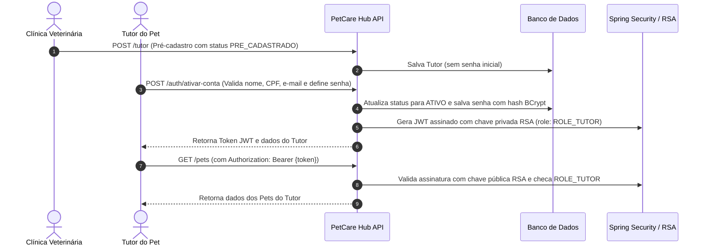
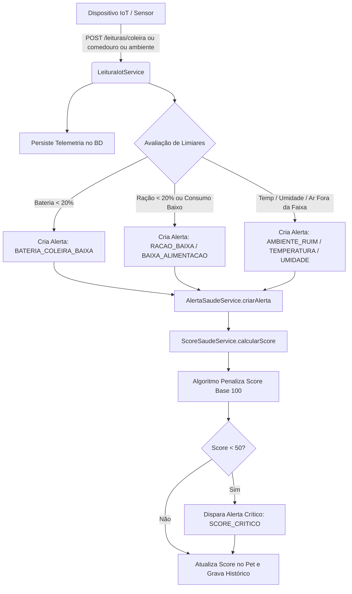

# PetCare Hub — API Java Advanced

<p align="center">
  
  
  
  
  
  
  
</p>

---

## 📌 Sumário Executivo

O **PetCare Hub** é um ecossistema completo para a continuidade do cuidado preventivo e monitoramento inteligente de animais de estimação. A aplicação central em **Java 17 + Spring Boot** atua como o **core de domínio, telemetria e inteligência em saúde**, provendo integração com o aplicativo frontend mobile, controle de versões de banco com Flyway, autenticação e autorização robusta via Spring Security com RBAC, e fluxos de negócio inteligentes além de operações de CRUD.


---

## 📱 Camada de Visualização & Integração Frontend

A camada de visualização do ecossistema PetCare Hub é composta por uma aplicação **Mobile**.

### 🔗 Repositório do Frontend / Mobile
> 📲 **Acesse o repositório do aplicativo mobile:**  
> **[https://github.com/PetCare-HUB/Mobile](https://github.com/PetCare-HUB/Mobile)**


---

## 🏛️ Arquitetura e Tecnologias

- **Linguagem & Framework**: Java 17, Spring Boot 3.3.5
- **Segurança**: Spring Security, Spring OAuth2 Resource Server, Nimbus Jose JWT, BCrypt Password Encoder, Par de Chaves Assimétricas RSA (2048-bit)
- **Persistência & Migração**: Spring Data JPA, Hibernate, Flyway Migration (`flyway-core`, `flyway-database-oracle`), JPA Criteria API / Specifications
- **Bancos de Dados**: Oracle Database 23c / 19c
- **Cache & Performance**: Spring Cache com Caffeine Cache (evicção por tempo e capacidade máxima)
- **Validação**: Jakarta Bean Validation (`hibernate-validator`) + `@MaxAge` Custom Validator
- **Documentação da API**: SpringDoc OpenAPI 3.0 / Swagger UI
- **Frontend / Mobile**: Consumo de API RESTful pelo App ([PetCare-HUB/Mobile](https://github.com/PetCare-HUB/Mobile))
- **Utilitários**: Lombok, Logback com logging estruturado em JSON e console

---

## 🔐 Spring Security & Controle de Acesso (RBAC)

A aplicação utiliza arquitetura de autenticação stateless baseada em **JWT (JSON Web Tokens)** assinados com um par de chaves **RSA** (2048-bit). As chaves não são versionadas no repositório — cada ambiente aponta pra elas via as variáveis `RSA_PUBLIC_KEY`/`RSA_PRIVATE_KEY` (veja [Gere o par de chaves RSA](#1-gere-o-par-de-chaves-rsa-uma-única-vez)).



### Perfis de Usuário e Permissões

1. **`ROLE_CLINICA`**:
   - Acesso total à gestão da clínica (`/clinicas/**`).
   - Cadastro e gerenciamento de tutores (`POST /tutor`).
   - Resolução e encerramento de alertas clínicos (`PUT /alertas/{id}/resolver`).
   - Acesso a métricas da clínica, agenda de 30 dias e pets em risco.
   - Consulta de dados clínicos e scores dos pets.

2. **`ROLE_TUTOR`**:
   - Cadastro e manutenção de seus pets (`POST /pets`, `PUT /pets/{id}`, `DELETE /pets/{id}`).
   - Ingestão de leituras de sensores IoT (`POST /leituras/coleira`, `/comedouro`, `/ambiente`).
   - Cadastro e conclusão de eventos preventivos (`POST /eventos-preventivos`, `PUT /eventos-preventivos/{id}/realizar`).
   - Visualização de histórico, timeline e plano preventivo do pet.

### Matriz de Proteção de Rotas

| Rota / Endpoint | Método(s) | Permissão / Role | Descrição |
|---|---|---|---|
| `/auth/login` | `POST` | Pública (`permitAll`) | Autenticação de Clínica ou Tutor com e-mail e senha. |
| `/auth/ativar-conta` | `POST` | Pública (`permitAll`) | Primeiro acesso do tutor para definir senha. |
| `/swagger-ui/**`, `/v3/api-docs/**` | `GET` | Pública (`permitAll`) | Documentação interativa da API. |
| `/tutor` | `POST` | `ROLE_CLINICA` | Pré-cadastro de tutor pela clínica parceira (a clínica é sempre a autenticada, não vem do corpo). |
| `/tutor/{id}` | `PUT`, `DELETE` | Autenticado + dono | Clínica edita/exclui qualquer tutor; um tutor só edita/exclui o próprio cadastro. |
| `/tutor/me` | `GET` | `ROLE_TUTOR` | Perfil do próprio tutor autenticado, incluindo a clínica do pré-cadastro. |
| `/clinicas/**` | `GET`, `POST`, `PUT`, `DELETE` | `ROLE_CLINICA` | Gestão de clínicas, métricas e dashboards. |
| `/protocolos-preventivos` | `POST` | `ROLE_CLINICA` | Criação de novo protocolo preventivo. |
| `/consultas/**` | `POST`, `PUT`, `DELETE` | `ROLE_CLINICA` | Agendamento/edição/exclusão de consultas. |
| `/alertas/{id}/resolver` | `PUT` | `ROLE_CLINICA` | Resolução médica de um alerta ativo. |
| `/pets` | `GET` | Autenticado | Tutor só vê os próprios pets (filtrado pelo token); clínica vê todos. |
| `/pets` | `POST` | `ROLE_TUTOR` | Cadastro de novo pet — o dono é sempre o tutor autenticado. |
| `/pets/{id}` | `PUT`, `DELETE` | `ROLE_TUTOR` + dono | Só o tutor dono do pet pode atualizar ou excluir. |
| `/leituras/**` | `POST` | `ROLE_TUTOR` | Envio de telemetria dos dispositivos IoT do pet. |
| `/eventos-preventivos` | `POST` | `ROLE_TUTOR` + dono do pet | Agendamento de evento preventivo pelo tutor. |
| `/eventos-preventivos/{id}` | `PUT`, `DELETE` | `ROLE_TUTOR` + dono | Edita (tipo/descrição/data) ou exclui um lembrete ainda não realizado. |
| `/eventos-preventivos/{id}/realizar` | `PUT` | `ROLE_TUTOR` + dono | Confirmação de realização de vacina/check-up. |
| `/pets/{id}/**` | `GET` | `ROLE_TUTOR`, `ROLE_CLINICA` | Consulta de timeline, scores, alertas e telemetria. |
| Demais rotas | `*` | Autenticado | Exige token JWT válido. |

---

## 🗄️ Flyway — Controle de Versões do Banco de Dados

O versionamento do banco é gerenciado de forma incremental e idempotente pelo Flyway, localizado em `src/main/resources/db/migration/`:

| Versão | Script SQL | Responsabilidade e Impacto |
|---|---|---|
| **V1** | `V1__create_tables.sql` | Criação das tabelas centrais do domínio: `CLINICA`, `TUTOR`, `PET`, `CONSULTA`, `PROTOCOLO_PREVENTIVO`, `EVENTO_PREVENTIVO`, `LEITURA_COLEIRA`, `LEITURA_COMEDOURO`, `LEITURA_AMBIENTE`, `ALERTA_SAUDE`, `SCORE_SAUDE`. |
| **V2** | `V2__create_sequences.sql` | Criação de sequences de auto-incremento para identificadores das entidades no Oracle Database. |
| **V3** | `V3__create_indexes.sql` | Criação de índices de chave estrangeira e busca rápida (CPF, E-mail, data de leitura, busca combinada de pets). |
| **V4** | `V4__add_defaults_sequences.sql` | Definição de valores default para colunas e integração de triggers de sequence. |
| **V5** | `V5__rename_responsavel_to_tutor.sql` | Refatoração de domínio para padronização de nomenclatura de `RESPONSAVEL` para `TUTOR`. |
| **V6** | `V6__add_auth_fields.sql` | Adição de colunas `senha_hash` e `status_acesso` com constraint de check (`PRE_CADASTRADO`, `ATIVO`, `BLOQUEADO`, `INATIVO`) para o Spring Security. |
| **V7** | `V7__fix_defaults_sequences.sql` | Ajustes de constraints, defaults e integridade referencial de sequences. |
| **V8** | `V8__split_leitura_sensor.sql` | Especialização e segregação das leituras IoT em tabelas dedicadas: coleira, comedouro e ambiente para escalabilidade. |
| **V9** | `V9__add_tutor_clinica.sql` | Adiciona `TUTOR.id_clinica` (FK pra `CLINICA`), preenchido no pré-cadastro. |

> Os nomes seguem a convenção padrão do Flyway (`V<versão>__descricao.sql`, com `V` maiúsculo e underscore duplo) — só assim o Flyway reconhece e aplica as migrações automaticamente.

---

## ⚙️ Fluxos de Negócio Completos (Além do CRUD)

### 🩺 Fluxo 1: Telemetria IoT ➔ Anomalias ➔ Alertas ➔ Score de Saúde



#### Regras de Penalidade do Score de Saúde:

- **Score Inicial**: 100 pontos.
- **Penalidades**:
  - Bateria da coleira < 20%: **-20 pts**
  - Nível de ração < 20%: **-10 pts**
  - Consumo alimentar muito baixo: **-20 pts**
  - Temperatura fora da faixa ideal: **-15 pts**
  - Umidade fora da faixa ideal: **-10 pts**
  - Qualidade do ar ruim (ppm alto): **-15 pts**
  - Alerta grave ativo: **-10 pts**
- **Categorias**:
  - `VERDE` (80 a 100) — Saudável / Seguro
  - `AMARELO` (50 a 79) — Atenção / Risco Moderado
  - `VERMELHO` (0 a 49) — Crítico (Gera alerta `SCORE_CRITICO`)

---

### 🛡️ Fluxo 2: Gestão Preventiva & Timeline Longitudinal com Cache

1. **Protocolos Preventivos com Cache Caffeine**:
   - Protocolos são agrupados por espécie (`CAO`, `GATO`, `OUTRO`) e tipo (`VACINA`, `VERMIFUGO`, `CHECKUP`).
   - Utiliza `@Cacheable(value = "protocolos")` com expiração de 10 minutos para máxima eficiência de leitura.
2. **Timeline Longitudinal Unificada**:
   - Endpoint `/pets/{id}/timeline` consolida consultas veterinárias, eventos preventivos realizados/pendentes e histórico de alertas clínicos em ordem cronológica reversa, oferecendo visão 360° do histórico do animal.
3. **Plano Preventivo do Pet**:
   - Endpoint `/pets/{id}/plano-preventivo` lista os eventos preventivos já cadastrados pro pet (pendentes e realizados), ordenados por data prevista. **Não há geração automática** a partir da idade do pet + `PROTOCOLO_PREVENTIVO` ainda — cada evento precisa ser criado explicitamente via `POST /eventos-preventivos`.

---

## 🔍 Validações de Formulários e Dados

A API utiliza validação estrita em todas as requisições de entrada:

### 1. Bean Validation Padrão
- `@NotBlank`, `@NotNull`: Campos obrigatórios.
- `@Size(min, max)`: Limites de tamanho de strings (nomes, telefones, observações).
- `@Email`: Validação de formato de e-mail RFC 5322.
- `@Positive`, `@Min`, `@Max`: Valores numéricos positivos e faixas de percentual (0 a 100%).
- `@PastOrPresent`: Datas que não podem estar no futuro (data de nascimento, timestamps de leitura).
- `@FutureOrPresent`: Datas de agendamento que não podem estar no passado (consultas, eventos preventivos).

### 2. Validação Customizada `@MaxAge`
Implementação de `ConstraintValidator` customizado em `validation/MaxAge.java` e `validation/MaxAgeValidator.java` para garantir que a data de nascimento do pet não ultrapasse o limite biológico plausível:

```java
@PastOrPresent(message = "A data de nascimento não pode estar no futuro.")
@MaxAge(value = 25, message = "A idade do pet não pode ultrapassar 25 anos.")
private LocalDate dataNascimento;
```

---

## 🚀 Como Executar o Projeto

### Pré-requisitos
- **Java 17 JDK** instalado e configurado nas variáveis de ambiente (`JAVA_HOME`).
- **Maven 3.8+** (ou utilizar o wrapper `./mvnw` incluso).
- **Banco Oracle Database** acessível (não há mais suporte a H2 em memória — as migrações Flyway usam sintaxe específica do Oracle, ex. `flyway-database-oracle`, sequences e outros recursos não compatíveis com H2).
- **Par de chaves RSA** (2048-bit) para assinatura dos tokens JWT — veja como gerar abaixo.

### 1. Gere o par de chaves RSA (uma única vez)

```bash
openssl genrsa -out private_key.pem 2048
openssl rsa -in private_key.pem -pubout -out public_key.pem
```

Essas chaves **não são versionadas no repositório** por segurança. Aponte a aplicação para elas via variáveis de ambiente (aceitam o conteúdo PEM direto ou um caminho `file:`):

```bash
# Linux/macOS
export RSA_PRIVATE_KEY="file:/caminho/para/private_key.pem"
export RSA_PUBLIC_KEY="file:/caminho/para/public_key.pem"

# Windows (PowerShell)
$env:RSA_PRIVATE_KEY="file:C:/caminho/para/private_key.pem"
$env:RSA_PUBLIC_KEY="file:C:/caminho/para/public_key.pem"
```

### 2. Execução com Banco Oracle Database

Defina as variáveis de ambiente com os dados do Oracle:

```bash
# Linux/macOS
export DB_URL="jdbc:oracle:thin:@localhost:1521/XEPDB1"
export DB_USERNAME="PETCARE"
export DB_PASSWORD="sua_senha_oracle"

# Windows (PowerShell)
$env:DB_URL="jdbc:oracle:thin:@localhost:1521/XEPDB1"
$env:DB_USERNAME="PETCARE"
$env:DB_PASSWORD="sua_senha_oracle"
```

Inicie a aplicação:

No Linux / macOS:
```bash
./mvnw clean spring-boot:run
```

No Windows (PowerShell / CMD):
```bash
mvnw.cmd clean spring-boot:run
```

O Flyway executará automaticamente as migrações `V1` a `V9` no banco Oracle.

- **API Base**: `http://localhost:8080`
- **Swagger UI (Frontend Interativo)**: `http://localhost:8080/swagger-ui.html`
- **OpenAPI JSON Docs**: `http://localhost:8080/v3/api-docs`

---

## 📖 Principais Endpoints da API

### 🔑 Autenticação (`/auth`)

| Método | Endpoint | Acesso | Descrição |
|---|---|---|---|
| `POST` | `/auth/login` | Público | Autentica usuário e retorna JWT com role e expiração. |
| `POST` | `/auth/ativar-conta` | Público | Ativa a conta pré-cadastrada do tutor e define a senha. |

### 👨‍⚕️ Clínicas (`/clinicas`)

| Método | Endpoint | Acesso | Descrição |
|---|---|---|---|
| `GET` | `/clinicas` | `ROLE_CLINICA` | Lista todas as clínicas parceiras. |
| `GET` | `/clinicas/{id}` | `ROLE_CLINICA` | Busca clínica por ID. |
| `GET` | `/clinicas/nome?nome={nome}` | `ROLE_CLINICA` | Busca clínica por parte do nome. |
| `POST` | `/clinicas` | `ROLE_CLINICA` | Cadastra nova clínica. |
| `PUT` | `/clinicas/{id}` | `ROLE_CLINICA` | Atualiza dados da clínica. |
| `DELETE` | `/clinicas/{id}` | `ROLE_CLINICA` | Remove clínica. |
| `GET` | `/clinicas/{id}/pets-em-risco` | `ROLE_CLINICA` | Lista pets com score na faixa amarela ou vermelha. |
| `GET` | `/clinicas/{id}/metricas` | `ROLE_CLINICA` | Métricas operacionais e de saúde preventiva da clínica. |
| `GET` | `/clinicas/{id}/agenda/proximos-30-dias` | `ROLE_CLINICA` | Próximas consultas e eventos dos pets vinculados. |
| `GET` | `/clinicas/{id}/alertas-iot/hoje` | `ROLE_CLINICA` | Alertas gerados nas últimas 24h para a clínica. |

### 🐶 Pets (`/pets`)

| Método | Endpoint | Acesso | Descrição |
|---|---|---|---|
| `GET` | `/pets` | Autenticado | Lista pets paginados — tutor só vê os próprios (filtrado no servidor pelo token); clínica vê todos. |
| `GET` | `/pets/{id}` | Autenticado | Detalhes do pet. |
| `GET` | `/pets/nome?nome={nome}` | Autenticado | Busca pets por nome. |
| `GET` | `/pets/busca?especie=CAO&raca=Golden` | Autenticado | Busca combinada dinâmica com JPA Specifications. |
| `POST` | `/pets` | `ROLE_TUTOR` | Cadastra novo pet — o dono é sempre o tutor autenticado, não o `tutorId` do corpo. |
| `PUT` | `/pets/{id}` | `ROLE_TUTOR` | Atualiza dados do pet. Só o tutor dono pode. |
| `DELETE` | `/pets/{id}` | `ROLE_TUTOR` | Remove o pet. Só o tutor dono pode. |
| `GET` | `/pets/{id}/score-saude` | Autenticado | Retorna o score de saúde atual e categoria. |
| `POST` | `/pets/{id}/score-saude/calcular` | Autenticado | Força recálculo algorítmico do score. |
| `GET` | `/pets/{id}/score-saude/historico` | Autenticado | Histórico de evolução do score do pet. |
| `GET` | `/pets/{id}/timeline` | Autenticado | Timeline longitudinal consolidada do animal. |
| `GET` | `/pets/{id}/plano-preventivo` | Autenticado | Lista os eventos preventivos já cadastrados pro pet (sem geração automática). |
| `GET` | `/pets/{id}/alertas/ativos` | Autenticado | Lista alertas clínicos pendentes de resolução. |

### 📡 Telemetria IoT (`/leituras`)

| Método | Endpoint | Acesso | Descrição |
|---|---|---|---|
| `POST` | `/leituras/coleira` | `ROLE_TUTOR` | Ingestão de leitura da coleira (bateria, atividade). |
| `POST` | `/leituras/comedouro` | `ROLE_TUTOR` | Ingestão de comedouro inteligente (nível, gramas). |
| `POST` | `/leituras/ambiente` | `ROLE_TUTOR` | Ingestão de sensores de ambiente (temp, umidade, ar). |
| `GET` | `/pets/{id}/leituras/coleira` | Autenticado | Histórico de leituras da coleira do pet. |
| `GET` | `/pets/{id}/leituras/comedouro` | Autenticado | Histórico de leituras do comedouro do pet. |
| `GET` | `/pets/{id}/leituras/ambiente` | Autenticado | Histórico de leituras do ambiente do pet. |

### 🚨 Alertas de Saúde (`/alertas`)

| Método | Endpoint | Acesso | Descrição |
|---|---|---|---|
| `GET` | `/alertas` | Autenticado | Busca alertas com filtros dinâmicos (Specification). |
| `POST` | `/alertas` | Autenticado | Cria alerta manual de saúde. |
| `PUT` | `/alertas/{id}/resolver` | `ROLE_CLINICA` | Marca alerta como resolvido pela clínica. |
| `DELETE` | `/alertas/{id}` | Autenticado | Exclui alerta. |

### 💉 Protocolos & Eventos Preventivos

| Método | Endpoint | Acesso | Descrição |
|---|---|---|---|
| `GET` | `/protocolos-preventivos` | Autenticado | Lista protocolos (Cache Caffeine). |
| `GET` | `/protocolos-preventivos/por-especie` | Autenticado | Lista protocolos filtrados por espécie. |
| `POST` | `/protocolos-preventivos` | `ROLE_CLINICA` | Cria novo protocolo de saúde. |
| `POST` | `/eventos-preventivos` | `ROLE_TUTOR` | Agenda evento preventivo para um pet (precisa ser pet do próprio tutor). |
| `PUT` | `/eventos-preventivos/{id}` | `ROLE_TUTOR` | Edita tipo, descrição e data prevista. Bloqueado se já realizado. |
| `PUT` | `/eventos-preventivos/{id}/realizar` | `ROLE_TUTOR` | Conclui evento preventivo agendado. |
| `DELETE` | `/eventos-preventivos/{id}` | `ROLE_TUTOR` | Exclui o lembrete. Bloqueado se já realizado. |

### 👤 Tutor (`/tutor`)

| Método | Endpoint | Acesso | Descrição |
|---|---|---|---|
| `POST` | `/tutor` | `ROLE_CLINICA` | Pré-cadastro do tutor pela clínica autenticada (define a clínica automaticamente). |
| `GET` | `/tutor/me` | `ROLE_TUTOR` | Perfil do próprio tutor, incluindo a clínica do pré-cadastro — útil antes de ter qualquer pet. |
| `PUT` | `/tutor/{id}` | Autenticado | Clínica edita qualquer tutor; tutor só edita o próprio cadastro. |
| `DELETE` | `/tutor/{id}` | Autenticado | Clínica exclui qualquer tutor; tutor só exclui o próprio cadastro. |

---

## 📝 Exemplos de Requisições JSON

### 1. Ativação de Conta do Tutor (`POST /auth/ativar-conta`)
```json
{
  "nome": "Kelson Silva",
  "cpf": "12345678901",
  "email": "kelson.petcare@example.com",
  "senha": "SenhaForte@123"
}
```

### 2. Login de Usuário (`POST /auth/login`)
```json
{
  "email": "kelson.petcare@example.com",
  "password": "SenhaForte@123"
}
```
*Resposta:*
```json
{
  "token": "eyJhbGciOiJSUzI1NiIsInR5cCI6IkpXVCJ9...",
  "tipo": "Bearer",
  "expiraEm": "2026-09-12T19:23:36.412Z",
  "role": "TUTOR",
  "tutorId": 1,
  "clinicaId": null
}
```

> `expiraEm` é o instante (ISO-8601) em que o token vence — o token dura 30 minutos a partir do login, não 24h. `tutorId` só vem preenchido pra quem logou como tutor; `clinicaId` só pra quem logou como clínica.

### 3. Cadastro de Pet com Validação (`POST /pets`)
```json
{
  "nome": "Rex",
  "especie": "CAO",
  "raca": "Golden Retriever",
  "dataNascimento": "2021-05-10",
  "pesoKg": 28.50,
  "sexo": "M",
  "condicoesCronicas": "Tendência a sobrepeso",
  "ativo": true,
  "tutorId": 1,
  "clinicaId": 1
}
```

### 4. Ingestão de Leitura IoT Coleira (`POST /leituras/coleira`)
```json
{
  "petId": 1,
  "statusAtividade": "ATIVO",
  "nivelBateria": 15
}
```
*Gera automaticamente um `AlertaSaude` de nível `MEDIO` (bateria < 20%) e atualiza o Score de Saúde para categoria de risco correspondente.*

---

## 📂 Estrutura de Pacotes do Projeto

```txt
src/main/java/fiap/com/br/petcarehub
├── auth                    # Configurações de Segurança, JWT RSA, AuthService, TokenService
│   ├── AuthController.java
│   ├── AuthService.java
│   ├── SecurityConfig.java
│   └── TokenService.java
├── config                  # DataLoader, SwaggerConfig, JPA Converters
├── controller              # Controladores REST da API
├── dto                     # Data Transfer Objects
│   ├── request             # Requisições com Bean Validation e @MaxAge
│   └── response            # Respostas formatadas e paginadas
├── entity                  # Entidades mapeadas para o banco
├── enums                   # Enums do domínio (Role, StatusAcesso, NivelAlerta, etc.)
├── exception               # GlobalExceptionHandler com ErroResponse padronizado
├── projection              # Projeções Spring Data JPA
├── repository              # Repositórios JPA com queries customizadas
├── service                 # Regras de negócio, Score de Saúde, Alertas e Cache
├── specification           # Especificações JPA (filtros dinâmicos Criteria API)
└── validation              # Validações customizadas (@MaxAge / MaxAgeValidator)

src/main/resources
├── Keys                    # Par de chaves RSA (private_key.pem, public_key.pem)
├── db/migration            # Migrações Flyway (v1 a v8 em SQL)
├── application.properties  # Configurações do Spring Boot, Cache e Flyway
└── logback-spring.xml      # Configuração de logs estruturados
```

---

## 👥 Integrantes da Equipe

| Nome | RM | Turma | GitHub | LinkedIn |
|---|---|---|---|---|
| **Alexander Dennis Isidro Mamani** | 565554 | 2TDSPG | [alex-isidro](https://github.com/alex-isidro) | [LinkedIn](https://www.linkedin.com/in/alexander-dennis-a3b48824b/) |
| **Kelson Zhang** | 563748 | 2TDSPG | [KelsonZh0](https://github.com/KelsonZh0) | [LinkedIn](https://www.linkedin.com/in/kelson-zhang-211456323/) |

---